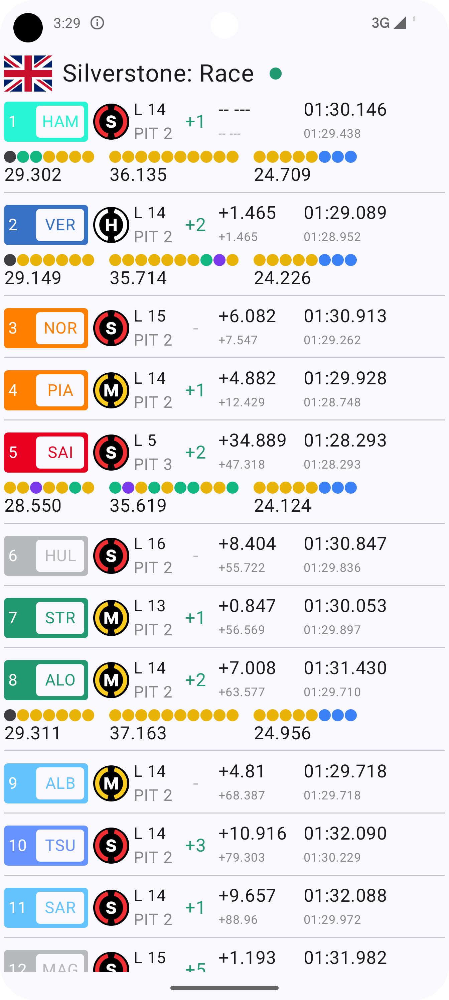

# Formula 1 Live Timing
Unnofficial F1 Live timing app based on the https://openf1.org/ API.

## Tech stack & used libraries

- Kotlin based, utilizing Flows & Coroutines for asynchronous operations.
- Jetpack Libraries:
  - Jetpack Compose
  - Viewmodel
  - Hilt
  - Navigation
  - Lifecycle
- Architecture:
  - MVVM
  - Repository Pattern

## Screenshots

